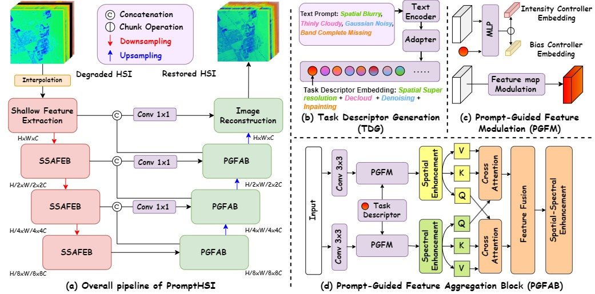

# PromptHSI: Universal Hyperspectral Image Restoration Framework for Composite Degradation (offical)
[[Paper Link]](https://arxiv.org/abs/2411.15922) [[Project Page]]()
#
[Chia-Ming Lee](https://ming053l.github.io/), [Ching-Heng Cheng](https://scholar.google.com/citations?user=2UmoEfcAAAAJ&hl=zh-TW), [Yu-Fan Lin](https://vanlinlin.github.io/), [Yi-Ching Cheng](https://scholar.google.com.tw/citations?hl=zh-TW&view_op=list_works&gmla=AL3_zihMkuibR4LNjVHu_kgdxNASDeqOgpk6WdtWbMqh_9Li88mia0ilpTPOmU8ZVvhaFbhQc9MZxSy8NNWA34MybUc&user=HFImtzUAAAAJ), [Wo-Ting Liao](https://scholar.google.com.tw/citations?hl=zh-TW&user=pD-HgBYAAAAJ&view_op=list_works&gmla=AL3_zigkGgH0LwxSKUG4Q1g4Ivld056uxUH1cjieMkWLSUmQrLMVAHx_Rx4PYSY8dHLOEdwah0TPr6FwDQVhqZhrhIh1yD34Ig3klXaP5Aw), [Chih-Chung Hsu](https://cchsu.info/wordpress/), [Fu-En Yang](https://fuenyang1127.github.io/), [Yu-Chiang Frank Wang](https://vllab.ee.ntu.edu.tw/ycwang.html)

Advanced Computer Vision LAB, National Cheng Kung University

## Introduction

The official pytorch implementation of the paper PromptHSI: Universal Hyperspectral Image Restoration Framework for Composite Degradation.




## How to use the code to train PromptHSI.
#### 1. Installation environment ####
```
python 3.10.15
pytorch 1.12.1
cuda 10.2
```

```
git clone https://github.com/chingheng
conda create --name prompthsi python=3.10 -y
conda activate prompthsi
# CUDA 10.2
pip install torch==1.12.1+cu102 torchvision==0.13.1+cu102 torchaudio==0.12.1 --extra-index-url https://download.pytorch.org/whl/cu102
cd PromptHSI
pip install -r requirements.txt
```
#### 2. Data Preparation ####

For the clear dataset collected from the <a href="https://aviris.jpl.nasa.gov/dataportal/">AVIRIS Data Portal</a> and the degradation dataset we generated, click <a href="https://drive.google.com/drive/u/1/folders/1-IQCY6ZsVGax7SL85bgE2z-Ef8gOcnL8">here</a> to download.  

The dataset includes 900/100/100 hyperspectral images for training, validation, and testing, respectively, and is stored in ".npy" and ".npz" formats for clear and degraded data.

After downloading, please place the dataset in the ```./data``` directory.

The structure of `data` directory should be like
```
  data
  ├── train
  │   ├── f060925t01p00r17rdn_c_sc01_ort_img_28.npy
  │   ├── f060925t01p00r17rdn_c_sc01_ort_img_31.npy
  │   ├── ...
  │   ├── f201007t01p00r13rdn_e_sc01_ort_img_167.npy
  │   └── f201007t01p00r13rdn_e_sc01_ort_img_211.npy
  ├── val
  │   ├── f060925t01p00r17rdn_c_sc01_ort_img_7.npy
  │   ├── f130804t01p00r10rdn_e_sc01_ort_img_53.npy
  │   ├── ...
  │   ├── f201007t01p00r14rdn_e_sc01_ort_img_200.npy
  │   └── f201007t01p00r14rdn_e_sc01_ort_img_242.npy
  ├── test
  │   ├── f060925t01p00r17rdn_c_sc01_ort_img_92.npy
  │   ├── f060925t01p00r17rdn_c_sc01_ort_img_104.npy
  │   ├── ...
  │   ├── f201007t01p00r14rdn_e_sc01_ort_img_229.npy
  │   └── f201007t01p00r14rdn_e_sc01_ort_img_230.npy
  └── Degradation
      ├── train
      │   ├── f060925t01p00r17rdn_c_sc01_ort_img_28_deg.npz
      │   ├── f060925t01p00r17rdn_c_sc01_ort_img_31_deg.npz
      │   ├── ...
      │   ├── f201007t01p00r13rdn_e_sc01_ort_img_167_deg.npz
      │   └── f201007t01p00r13rdn_e_sc01_ort_img_211_deg.npz
      ├── val
      │   ├── f060925t01p00r17rdn_c_sc01_ort_img_7_deg.npz
      │   ├── f130804t01p00r10rdn_e_sc01_ort_img_53_deg.npz
      │   ├── ...
      │   ├── f201007t01p00r14rdn_e_sc01_ort_img_200_deg.npz
      │   └── f201007t01p00r14rdn_e_sc01_ort_img_242_deg.npz
      └── test
          ├── f060925t01p00r17rdn_c_sc01_ort_img_92_deg.npz
          ├── f060925t01p00r17rdn_c_sc01_ort_img_104_deg.npz
          ├── ...
          ├── f201007t01p00r14rdn_e_sc01_ort_img_229_deg.npz
          └── f201007t01p00r14rdn_e_sc01_ort_img_230_deg.npz
```

#### 3. Train the model #####
Edit the `options.py` file to configure the hyperparameters, then execute the following command: 
```
# train
python train.py 

# Testing
python test.py
```

Our pre-trained model is under `./ckpt/` already, with the name `BEST-PromptHSI.pth`.

#
If our work is helpful to your reaearch, please kindly cite our work. Thank!
#### BibTeX ####
```
@misc{lee2024prompthsiuniversalhyperspectralimage,
  title={PromptHSI: Universal Hyperspectral Image Restoration Framework for Composite Degradation}, 
  author={Chia-Ming Lee and Ching-Heng Cheng and Yu-Fan Lin and Yi-Ching Cheng and Wo-Ting Liao and Chih-Chung Hsu and Fu-En Yang and Yu-Chiang Frank Wang},
  year={2024},
  eprint={2411.15922},
  archivePrefix={arXiv},
  primaryClass={eess.IV},
  url={https://arxiv.org/abs/2411.15922}, 
}
```